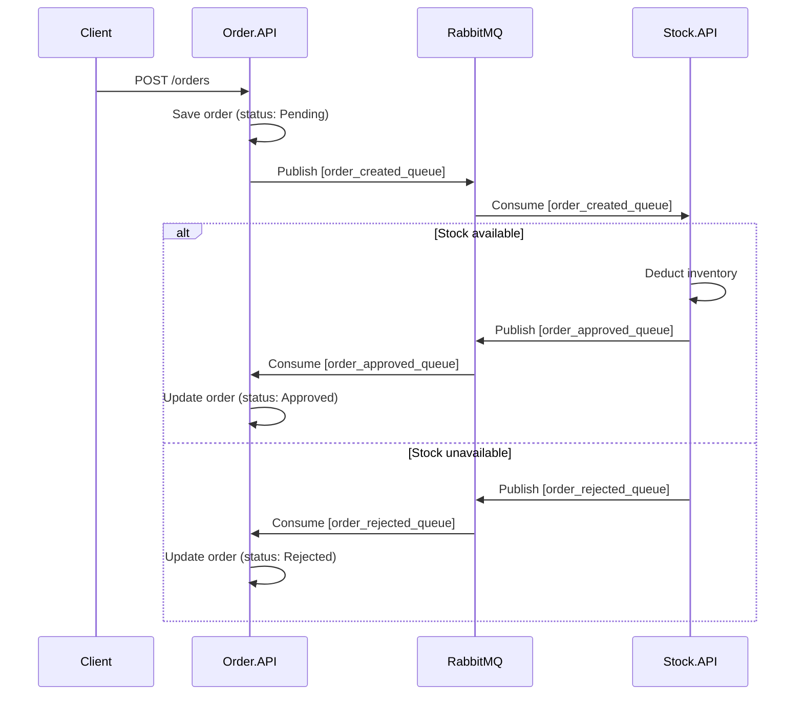

# Distributed Order Flow System
### Choreographed Saga Pattern · .NET 8 · PostgreSQL · RabbitMQ

A resilient, event-driven microservices ecosystem designed to process e-commerce orders asynchronously, implementing the **Choreographed Saga Pattern** to guarantee eventual consistency across services without tight coupling.

---

## Architecture Overview



---

## Services

| Service | Responsibility | Database | Port |
|---|---|---|---|
| `Order.API` | Order lifecycle management | `orderflow_db` | 8081 |
| `Stock.API` | Inventory validation and deduction | `stock_db` | — |
| `RabbitMQ` | Async message broker | — | 5672 / 15672 |
| `PostgreSQL 16` | Persistent storage (Database-per-Service) | — | 5432 |

---

## Technical Highlights

- **Choreographed Saga:** distributed transactions managed purely through events, with no central orchestrator — eliminating single points of failure.
- **Database-per-Service:** `Order.API` and `Stock.API` each own an isolated PostgreSQL database, preventing data coupling between services.
- **Resilient Workers:** background consumers use persistent retry loops to tolerate broker initialization delays.
- **Security:** credentials are fully decoupled from source code via `.env` variables. See `.env.example`.
- **Healthchecks:** PostgreSQL and RabbitMQ expose healthcheck endpoints so dependent services only start after infrastructure is ready.

---

## How to Run

**Prerequisites:** Docker and Docker Compose installed.

```bash
# 1. Clone the repository
git clone https://github.com/anapeniche/OrderFlowSystem.git
cd OrderFlowSystem

# 2. Create your environment file
cp .env.example .env
# Edit .env with your credentials

# 3. Start all services
docker-compose up -d --build

# 4. Verify all containers are healthy
docker ps
```

**Expected result:**
```
postgres_orderflow  → Up (healthy)
rabbitmq_broker     → Up (healthy)
stock_api           → Up
order_api           → Up  →  http://localhost:8081
```

RabbitMQ Management UI: http://localhost:15672

---

## Testing the Flow

```bash
# Create an order
curl -X POST http://localhost:8081/api/orders \
  -H "Content-Type: application/json" \
  -d '{"productId": 1, "quantity": 1}'
```

Watch the saga execute across services:
```bash
docker logs order_api -f
docker logs stock_api -f
```

---

## Roadmap

- [ ] Dead Letter Queues (DLQ) for poison message handling
- [ ] Idempotency keys to prevent duplicate message processing
- [ ] JWT Authentication on API endpoints
- [ ] Centralized logging with Serilog + Seq
- [ ] Outbox Pattern to guarantee at-least-once delivery

---

## Tech Stack


